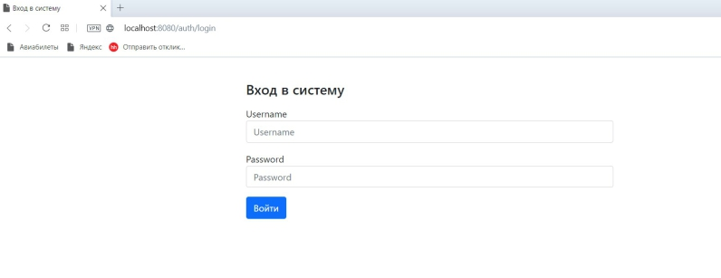

# Управление складом товаров.
### Авторизация пользователей:

* Работа с приложением возможна только после авторизации пользователей посредством логина и пароля.

* Система должна поддерживать две роли пользователей – администратор и пользователь.

* Администратору склада доступны все операции по просмотру и модификации данных, пользователь может только просматривать информацию.

* Информация о ролях  и пользователях хранится в базе данных. При запуске приложения должна создаваться таблица со списком ролей и пользователей. При повторном запуске приложения эта информация не должна быть изменена или удалена.


#
### 	Список категорий товаров:

* Все товары склада организованы по категориям. Категории описываются двумя полями: название и описание. 
* Приложение должно содержать страницу со списком категорий (допускается отсутствие постраничного вывода). На ней категории представляются в таблице со сл. полями: название, кол-во товаров, описание и действия (доступно только для администраторов). 
* В режиме просмотра название выводится полностью, поле описание содержит первые 150 символов. 
* В столбце «действия» доступны две операции – «редактировать» и «удалить».
* Операция «редактировать» должна открыть ту же страницу. Ряд для редактируемой категории должен содержать input для названия и textarea для описания.
* Операция «удалить» удаляет выбранную категорию (после доп. подтверждения пользователя (javascript: confirm)), при этом все товары данной категории удаляются.
Должна быть реализована функция добавления категории.
* Поле «название» является обязательным.
* Необходимо учесть, что в системе не может быть двух категорий с одинаковым названием – пользователь должен получать соответствующее сообщение об ошибке.


#
### 	Список товаров:

* Товар описывается сл. полями: категория, изображение, название, описание, цена, количество на складе.
* Сверху таблицы должен находится список категорий товаров, если категория не выбрана – показываются все товары на складе.
* Должны быть доступны операции добавления товара, изменения информации о товаре и удаление товара. Добавление и редактирование товара должны выполняться в новом окне. 
* Добавление и редактирование товара должны поддерживать загрузку изображений.


### Используемый стек

* Spring Boot
* Spring Security
* Spring JPA
* Hibernate
* СУБД PostgeSQL


## Запуск приложения.

**1. При первом запуске идёт создание таблиц из файла schema.sql.**

**По умолчанию таблицы пустые, для автоматического заполнения необходимо раскомментировать соответствующие записи.** 

**2. После успешного запуска необходимо перейти в браузере по адресу**



```
http://localhost:8080/auth/login
Вход под администратором:
логин admin
пароль admin
```
